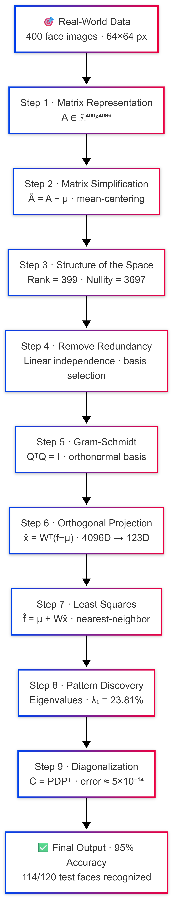
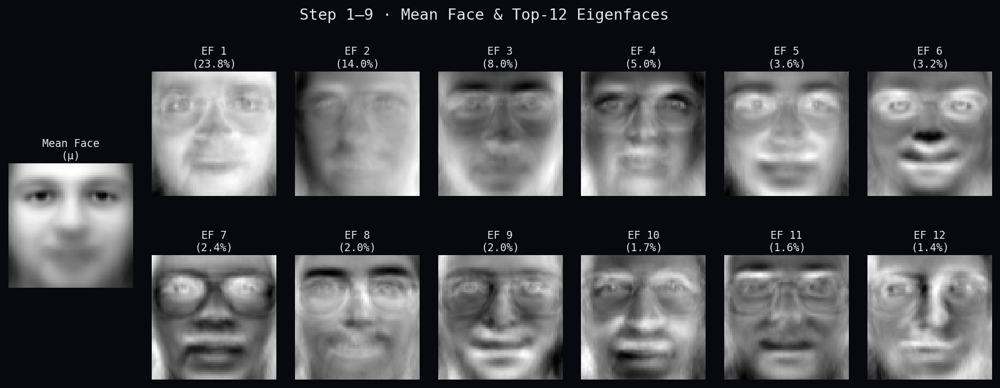
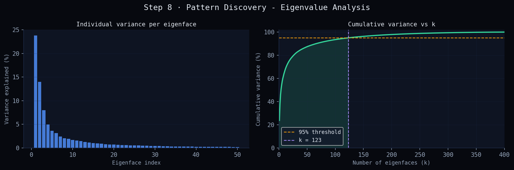
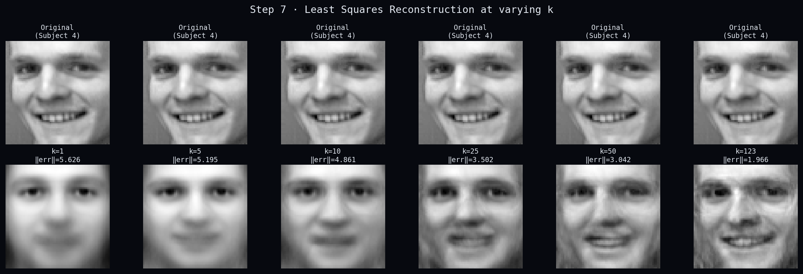
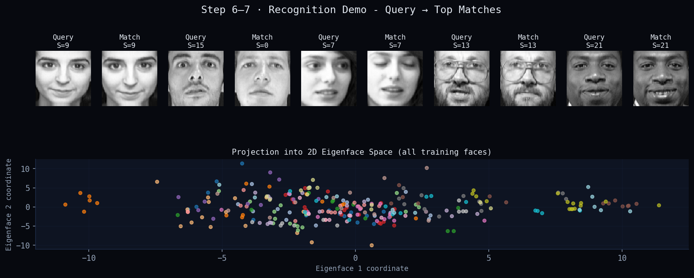

# Face Recognition Using Eigenfaces

### UE24MA241B - Linear Algebra and Its Applications | PES University

> A complete 9-step Linear Algebra pipeline applied to face recognition - from raw pixel data to identity prediction using PCA, Gram-Schmidt orthogonalization, least squares reconstruction, and eigendecomposition.

---

## Team

| SRN           | Name              |
| ------------- | ----------------- |
| PES2UG24CS018 | Aayush Gupta      |
| PES2UG24CS019 | Abhigyan Dutta    |
| PES2UG24CS036 | Aditya Shrivastav |
| PES2UG24CS042 | Akash Singh       |

---

## Problem Statement

Face images are high-dimensional data - a 64×64 grayscale image has 4096 pixel values. Recognizing faces requires finding the key patterns that distinguish one person from another, while ignoring noise and redundancy. This project applies a structured Linear Algebra pipeline to solve that problem: compressing faces into a low-dimensional "eigenface space" and recognizing identities using nearest-neighbor matching.

**Dataset:** AT&T/Olivetti Face Database - 40 subjects × 10 images each = 400 images (64×64 px), loaded via `sklearn.datasets.fetch_olivetti_faces`.

**Final result:** 95% recognition accuracy (114/120 test images correct) using only 123 eigenfaces out of 4096 dimensions.

---

## LA Pipeline



---

## Results

### Mean Face + Top-12 Eigenfaces



### Eigenvalue Analysis - Variance per Component



### Least Squares Reconstruction at Varying k



### Recognition Demo - Query → Match



---

## Key Results Summary

| Metric                               | Value                                   |
| ------------------------------------ | --------------------------------------- |
| Dataset                              | AT&T Olivetti (400 images, 40 subjects) |
| Data matrix A                        | 400 × 4096                             |
| Rank(Ã)                             | 399                                     |
| Eigenfaces needed for ≥95% variance | k = 123                                 |
| Top eigenvalue λ₁ variance share   | 23.81%                                  |
| Diagonalization error ‖C − PDPᵀ‖ | 5.27 × 10⁻¹⁴                        |
| Train / Test split                   | 7 / 3 per subject                       |
| Recognition accuracy                 | **95.0% (114/120)**               |

---

## File Structure

```
LAA-Miniproject/
├── eigenfaces.py                  # Full pipeline - all 9 steps
├── eigenfaces_presentation.pptx  # Project slides
├── images/
│   ├── fig1_eigenfaces.png        # Mean face + top-12 eigenfaces
│   ├── fig2_variance.png          # Scree plot + cumulative variance
│   ├── fig3_reconstruction.png    # Reconstruction at varying k
│   └── fig4_recognition.png      # Recognition demo + 2D projection
└── README.md
```

---

## How to Run

### Requirements

```bash
pip install numpy matplotlib scikit-learn
```

### Run

```bash
python eigenfaces.py
```

The script will:

1. Load the Olivetti face dataset (downloads ~1.4 MB on first run, cached after)
2. Run all 9 pipeline steps with printed explanations
3. Save 4 figures to the current directory
4. Print final recognition accuracy

> **Note:** First run requires internet to download the dataset. All subsequent runs use the cached version.

---

## Concepts Covered

| Step | LA Concept                          | What it does here                                         |
| ---- | ----------------------------------- | --------------------------------------------------------- |
| 1    | Matrix representation               | 400 face images → one 400×4096 data matrix              |
| 2    | Gaussian elimination / RREF analogy | Mean-centering removes common baseline                    |
| 3    | Vector spaces, rank, nullity        | Face space is 399-dimensional; 3697 directions never vary |
| 4    | Linear independence, basis          | Eigenvectors of C_small give independent face directions  |
| 5    | Gram-Schmidt                        | Orthonormalizes basis → QᵀQ = I                         |
| 6    | Orthogonal projection               | Compresses 4096D face to 123-number fingerprint           |
| 7    | Least squares                       | Reconstructs face; recognition via nearest neighbor       |
| 8    | Eigenvalues & eigenvectors          | Ranks facial patterns by variance explained               |
| 9    | Diagonalization                     | C = PDPᵀ; keeps top-k, discards noise                    |

---

*UE24MA241B - Linear Algebra and Its Applications, Semester 4, PES University*
